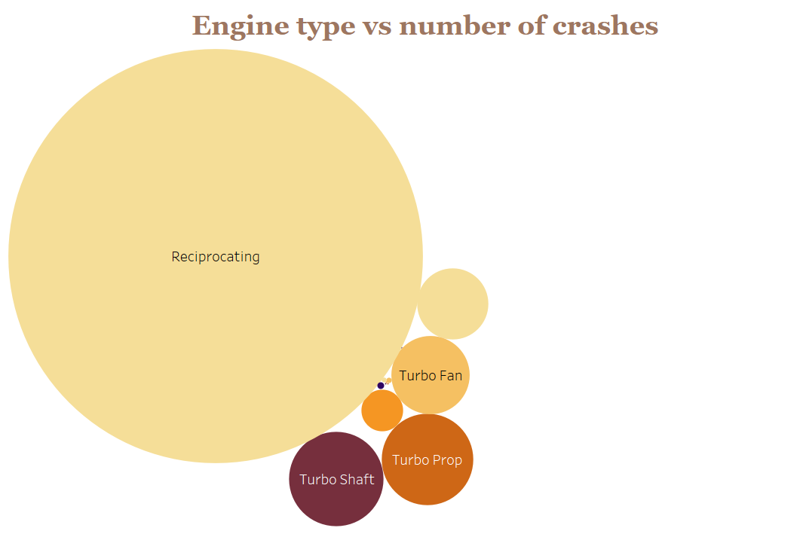
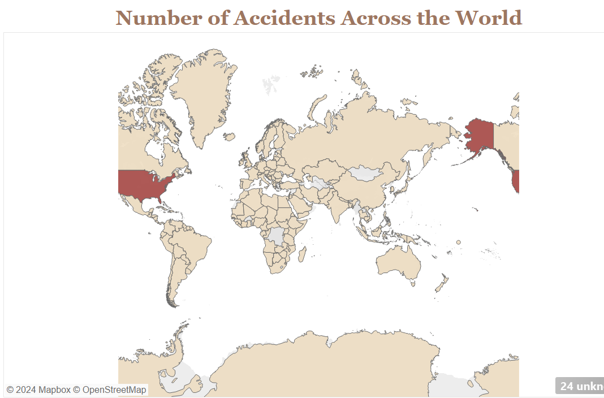
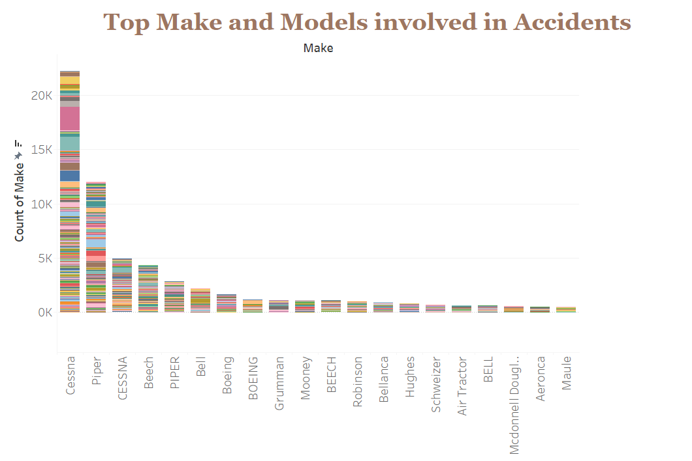

# Aviation-Analysis
Author: [Evans Makau](makauevans01@gmail.com)
## Overview
This project analyzed aviation data collected over a span of a couple of years. The analysis shows the effect different factors have on the accident rates and gives recommendations on investing in the industry.
## Business problem
We aim to figure out:
Aircraft manufacturers to invest in.
Engine models and makes with proven safety records
Less accident-prone areas
Types of flights e.g. instructional, public flights to invest in
## Data

The dataset contains data from the National Transport Safety Board that is comprised of aviation accident data from 1962 to 2023 in the United States and International Waters. The data contains records such as engine types, engine models, makes, weather conditions
leading into the accidents listed.
## Methods
This project uses visualization to gain insight into the effect these different
factors have on the accident rates. 

## Results and conclusions

Reciprocating engines have high accident rates

U.S.A. is a high-risk aviation area as per the high number of accidents recorded there.

CESSNA and piper engines have very high failure rates.

## Recommendations

Investment into engine manufacturers with lower accident rates such as Maule and BELL instead of ones with higher rates e.g. Piper, Bell and Cessna.

Invest in other areas in the world apart from USA which has very high accident rates.

Invest in multi engine aircraft which have a lower accident rates compared to single engine aircraft.

Invest in engine types with a lower crash rate such as the electric engine, the turbofan and the geared turbofan engine

## Next steps

Including financial details of the various recommendations provided to come up with a good investment model.

Predict low risk areas with good profits.

## For more information
Review the [Jupyter Notebook](aviationdata.ipynb)
Review the [presentation](aviationppt.pptx)
View my [Tableau Dashboard](https://public.tableau.com/shared/B42CTDDSW?:display_count=n&:origin=viz_share_link)
